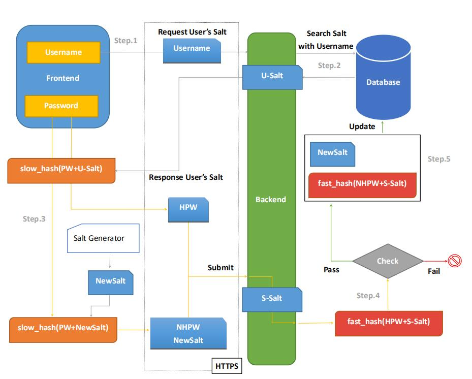

# 用户系统设计蓝图

用户系统的构建主要从三个层次进行设计：数据层、应用层和协议层。

其中，数据层是协议层的实现、应用层是对数据层的封装使用。

## 协议层

1. 用户账户与用户系统的不可分性

规定：用户账户是用户系统的承载实体，即用户系统的设计均交由用户账户及相关业务逻辑进行实现。

2. 用户账户的无特殊性

规定：所有用户均使用同一套用户系统，由业务层逻辑进行提升、鉴别。

3. 用户系统准入协议

暂未提供第三方接入的接口和用户系统调用协议。

4. 用户账户体系要素

- 用户标识符(UID)：由系统分配的唯一数字编号，按注册时间从0起。
- 用户名(Username)：唯一、对外不可见，由用户自定义，不可修改。
- 用户账户(User Account)：唯一、与用户名兼容，留作邮箱或手机登录的保留字，因此后期可有条件更改。
- 用户昵称(Nickname)：对外可见且允许重复，由用户自定义且可有条件更改。
- 开放账户(OpenID)：第三方登录接口保留字。

5. 用户系统安全性

- 用户密码(Password)应当具有一定的复杂度。
- 用户密码在数据库的存储应以加密存储为基准。
- 采用快慢加密及哈希加盐(Salt)的方式防止哈希碰撞攻击(如:彩虹表)和数据库脱库攻击，在数据传输上仍需依赖HTTPS提供传输安全性。
- 通过更新用户所属盐值的方式，定期为用户更新数据库中的密码。

基于快慢加密的前后端用户身份校验交互协议流程图：

6. 数据库协同

目前无使用数据库集群的打算。

采用MySQL+Redis的方式，MySQL存放键索引，通过键索引在Redis中查得结构灵活性较大的数据。即，MySQL仅作关系型数据的存储。

7. 静态账户数据和动态业务数据分离

账户信息及附属信息(如，头像、Nickname等内容)，仅通过UID进行级联，而不放在同一个表里。

8. 用户权限(Authority)设计

用户权限为一个32位整数值，通过位运算叠加、比对用户的相应权限。

用户类型|说明|值级
:-:|:-:|:-:
封禁用户|被封禁的用户|1
普通用户|普通网站用户|2
付费用户|普通网站付费用户|4
管理员|协助管理员进行部分管理|8
超级管理员|对网站具有绝对管理能力|16

除此之外，还可以对个别用户进行单项权限赋予：

附加权限|说明|值级
:-:|:-:|:-:
后台数据读取|可以进入后台进行数据分析|2048
...|...|...(2^11~2^31)

### 账户体系各数据字段细节

- 用户标识符(UID)：一个自0起的无符号正整数。
- 用户名(Username)：长度在6~16(含)的字符，合法字符为英文、数字和下划线。
- 用户账户(User Account)：另作定义，原则上为通过正则合法性校验的邮箱、手机号码(含国际区号)。
- 用户昵称(Nickname)：长度在1~16(含)个中英文字符，合法字符为Unicode所收录的字符。
- 开放账户(OpenID)：另作定义，原则上为一个具有具体含义的Token串。 
- 用户密码(Password)：明文密码为长度在6~16(含)的英文、数字等非制表符混合串，原则上至少需要包含大小写英文、数字和下划线等符号中的两种。在数据库中以32位的Hash串进行存储。

## 数据层

用户账户表:

字段|值类型|说明
:-:|:-:|:-:
UID|INT UNSIGNED|用户标识符
Username|VARCHAR(16)|用户名
Account|VARCHAR(-)|用户账户
OpenID|VARCHAR(-)|开放账户
Password|CHAR(32)|用户密码(Hash)
Salt|CHAR(-)|用户的盐
Authority|INT|用户的权限

详细用户账户表设计及用户资料表等附属表，参见：[hypethron-database.sql](/server/dao/hypethron-database.sql)。

> Tip:可以使用[DBVTranslator](https://github.com/WhiteRobe/DBVTranslator)等小工具将`sql`文件转化为表格便于阅读。

## 应用层

应用层应对[账户体系各数据字段细节](#账户体系各数据字段细节)中的各字段进行校验和数据存库。

应用层在需要进行联表查询等操作时，应注意不将非必要数据代入更深的业务逻辑中。如：OpenID仅用作第三方登录时，则不应该将其深入到其它业务接口。